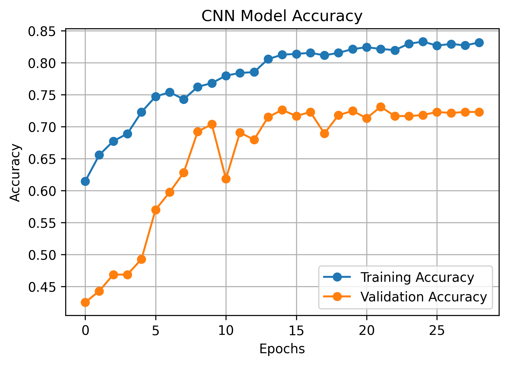
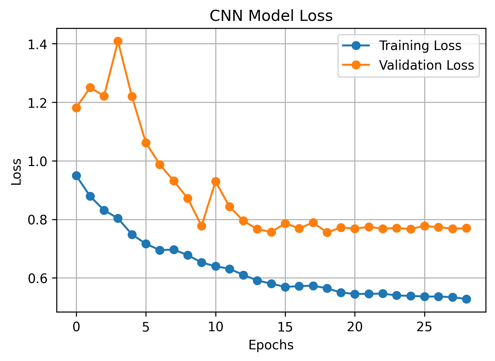
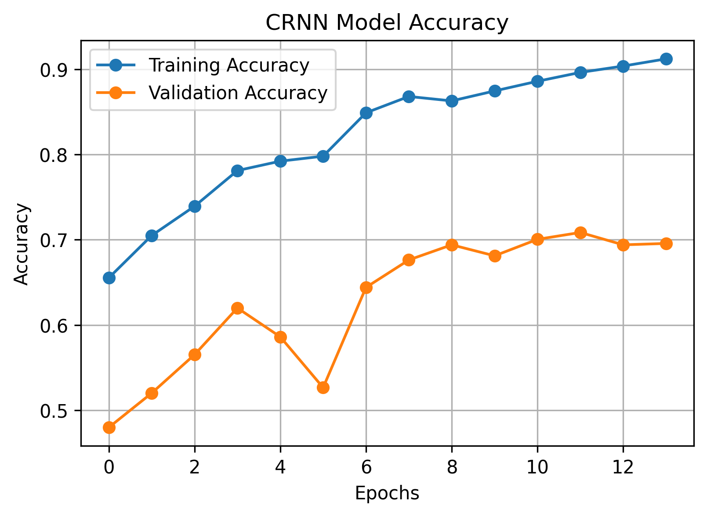
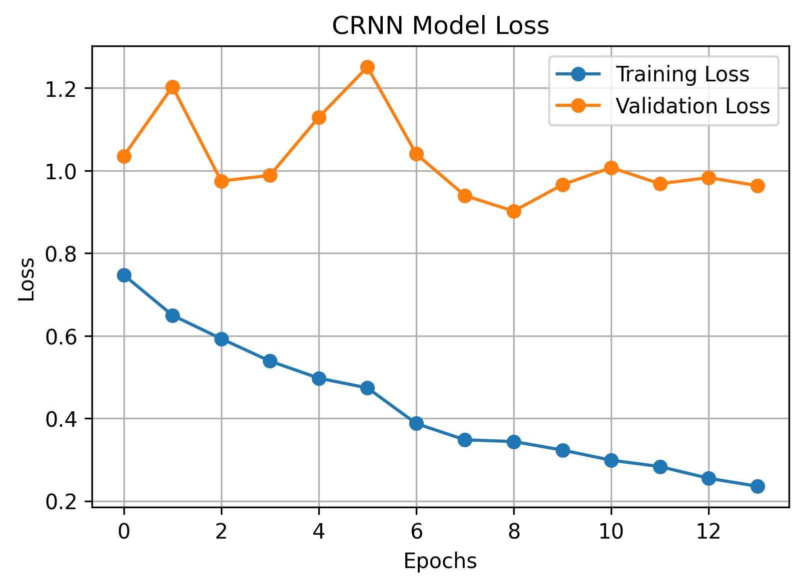
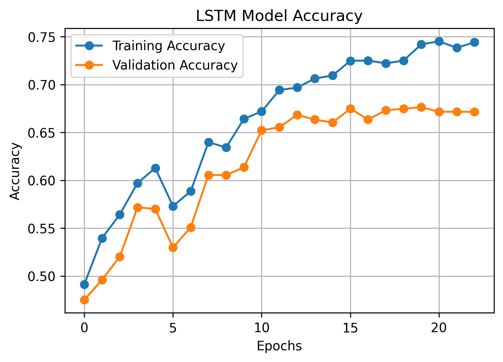
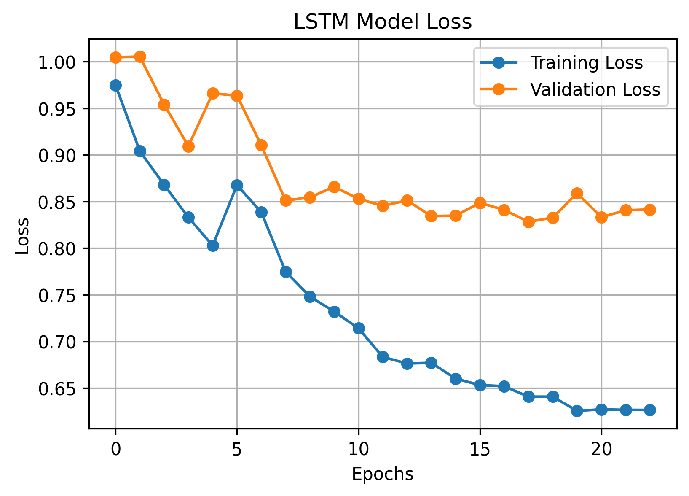
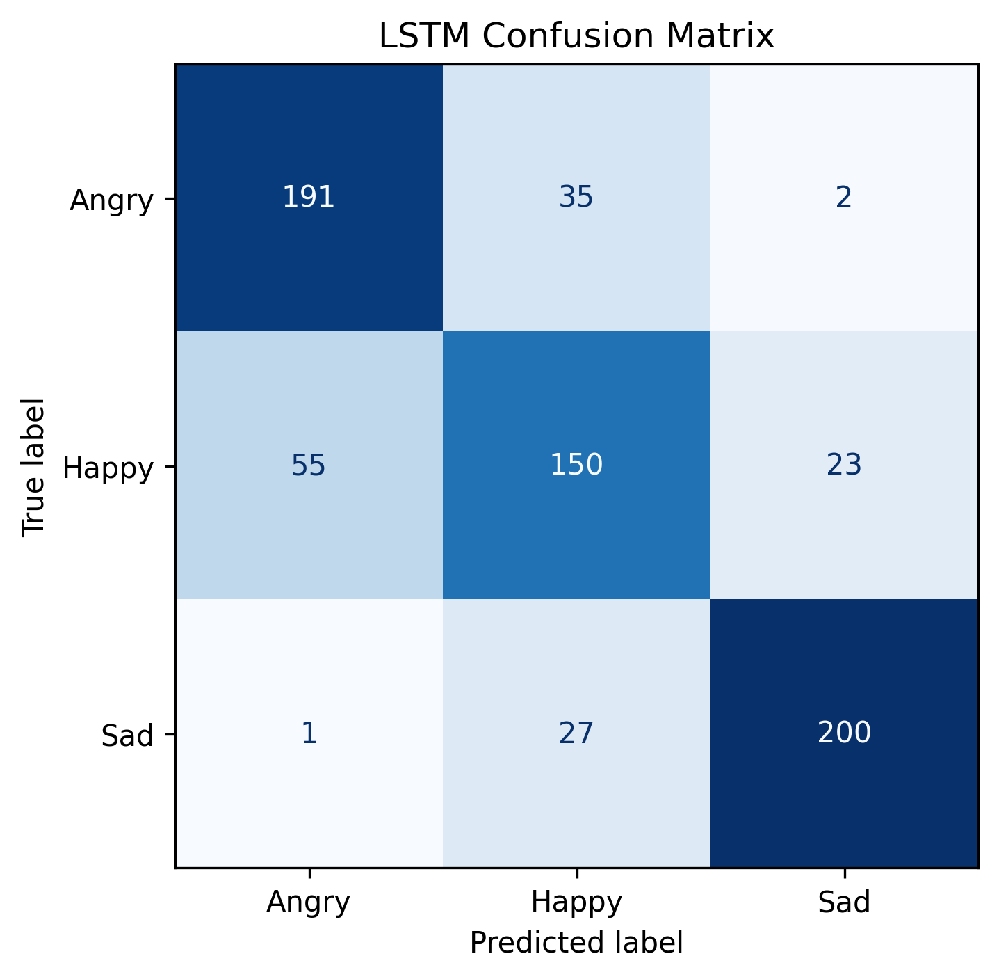
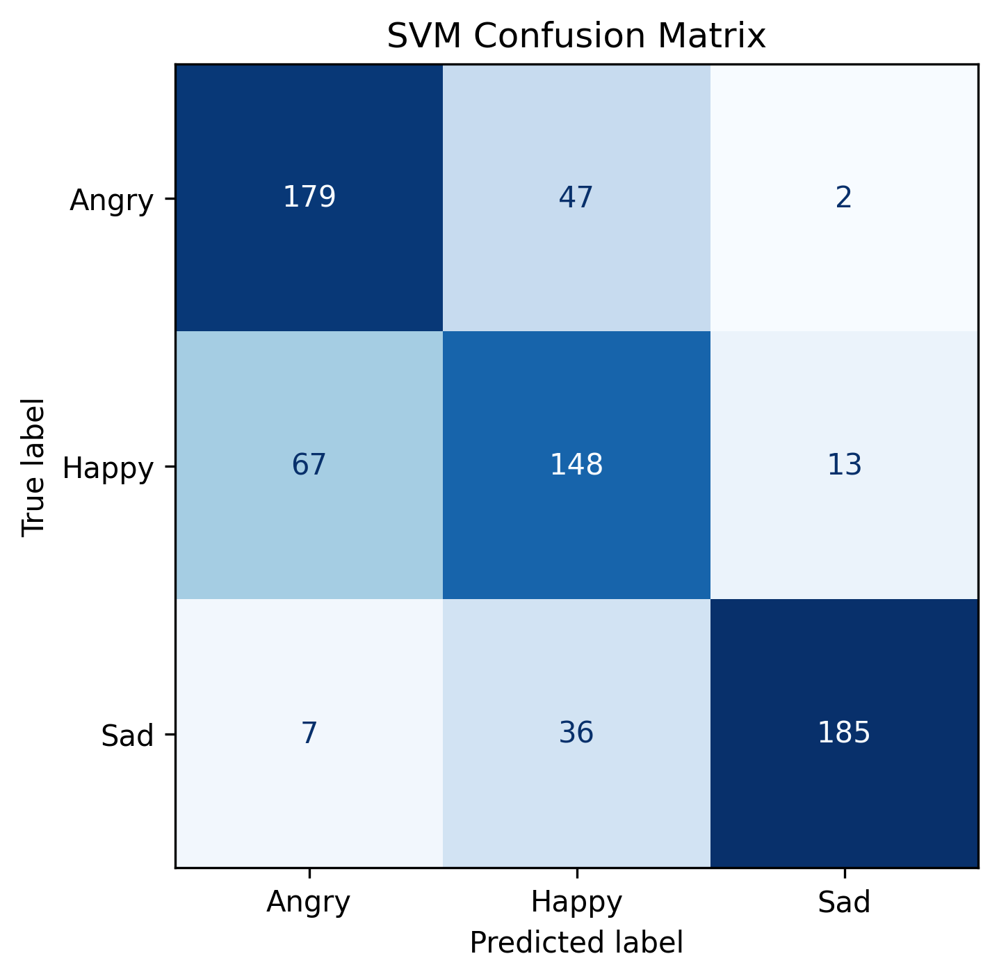

# 🎙️ Cross-Dataset Speech Emotion Recognition Using Deep Learning Models

> A comprehensive Speech Emotion Recognition (SER) project that investigates multiple Machine Learning, Deep Learning, Domain Adaptation, and Transformer-based architectures using the **RAVDESS** and **CREMA-D** datasets. The project focuses on evaluating different approaches for cross-dataset emotion recognition and identifying robust models for real-world speech emotion classification.

---

# 📌 Project Overview

Speech Emotion Recognition (SER) is an important research area in Artificial Intelligence that enables machines to understand human emotions from speech signals. It has applications in healthcare, intelligent virtual assistants, human-computer interaction, education, customer service, mental health monitoring, and conversational AI.

Although many SER models achieve excellent performance on individual datasets, they often fail to generalize when evaluated on unseen datasets due to differences in speakers, recording environments, and speech characteristics.

This project addresses this challenge by performing a comprehensive comparative study using two publicly available emotional speech datasets: **RAVDESS** and **CREMA-D**. Throughout this research, multiple Machine Learning, Deep Learning, Domain Adaptation, and Transformer-based architectures were explored and compared to analyze their effectiveness for cross-dataset Speech Emotion Recognition.

Rather than focusing on a single model, this repository documents the complete research journey—from dataset preparation and feature extraction to extensive experimentation, model comparison, and final implementations.

---

# 🚀 Project Highlights

* 🎙️ Cross-Dataset Speech Emotion Recognition using **RAVDESS** and **CREMA-D**
* 🎧 End-to-end audio preprocessing and dataset standardization
* 📊 Log-Mel Spectrogram feature extraction
* 🤖 Comparative evaluation of **9+ Machine Learning, Deep Learning, and Transformer-based models**
* 🧠 Implemented CNN, CRNN, LSTM, SVM, DANN, Wav2Vec, HuBERT, Whisper, and Ensemble architectures
* 🏆 **Highest Accuracy Model:** CNN (**82.60%**)
* ⭐ **Best Hybrid Model:** CRNN (CNN + BiLSTM) (**80.56%**)
* 📈 Complete research workflow from dataset preparation to final model comparison
* 📚 Well-organized repository containing preprocessing, experimentation, evaluation, and final implementations

---

# ✨ Features

* Cross-Dataset Speech Emotion Recognition using **RAVDESS** and **CREMA-D**
* Audio preprocessing and dataset standardization
* Log-Mel Spectrogram feature extraction
* Comparative analysis of Machine Learning, Deep Learning, Domain Adaptation, and Transformer models
* Evaluation of CNN, CRNN, LSTM, SVM, DANN, Wav2Vec, HuBERT, Whisper, and Ensemble architectures
* Performance evaluation using Accuracy, Precision, Recall, F1-Score, and Confusion Matrix
* Includes both the **Highest Accuracy CNN Model** and the **Best Hybrid CRNN Model**
* Organized research workflow from preprocessing to final model implementations

---

# 🔄 Project Workflow

```text
                  RAVDESS Dataset
                         │
                         │
                  CREMA-D Dataset
                         │
                         ▼
              Audio Preprocessing
                         │
                         ▼
            Dataset Standardization
                         │
                         ▼
      Log-Mel Spectrogram Extraction
                         │
                         ▼
          Research Experiments
      ┌─────────────────────────────┐
      │ CNN                         │
      │ CRNN                        │
      │ LSTM                        │
      │ SVM                         │
      │ DANN                        │
      │ Wav2Vec + DANN              │
      │ HuBERT                      │
      │ Whisper                     │
      │ CNN + CRNN Ensemble         │
      └─────────────────────────────┘
                         │
                         ▼
             Comparative Evaluation
                         │
                         ▼
                Final CNN & CRNN Models
                         │
                         ▼
          Speech Emotion Classification
```

The project follows a structured research workflow beginning with dataset preparation, preprocessing, and feature extraction. Multiple Machine Learning, Deep Learning, Domain Adaptation, and Transformer-based architectures were implemented and evaluated. Finally, comparative analysis identified two key implementations included in this repository: the **CNN model**, which achieved the highest classification accuracy, and the **CRNN (CNN + BiLSTM)** model, which represents the strongest hybrid architecture explored during the study.


---

# 📂 Project Organization

The repository is organized to reflect the complete research workflow followed during the development of the Speech Emotion Recognition system.

* **Data Preparation** – Audio preprocessing, feature extraction, dataset harmonization, and preparation of the RAVDESS and CREMA-D datasets.
* **Research Experiments** – Implementation and evaluation of multiple Machine Learning, Deep Learning, Domain Adaptation, and Transformer-based architectures.
* **Model Comparison** – Comparative analysis of CNN, CRNN, LSTM, and SVM models using multiple evaluation metrics.
* **Final Models** – Final implementations of the **CNN (Highest Accuracy Model)** and **CRNN (Best Hybrid Model)** selected after extensive experimentation.
* **Assets** – Training curves, confusion matrices, workflow diagrams, dataset visualizations, and model architecture figures used throughout the project.

This organization provides a complete view of the research process, from raw data preparation to final model evaluation and performance analysis.


---

## 📁 Folder Description

| Folder         | Description                                                                                                            |
| -------------- | ---------------------------------------------------------------------------------------------------------------------- |
| **assets/**    | Project images, workflow diagrams, architecture diagrams, training curves, confusion matrices, and evaluation results. |
| **data/**      | Dataset information and download references for the RAVDESS and CREMA-D datasets.                                      |
| **models/**    | Directory reserved for trained model checkpoints and saved model weights.                                              |
| **notebooks/** | Complete research workflow, including data preparation, experimentation, model comparison, and final implementations.  |

---

# 📊 Datasets

This project utilizes two publicly available emotional speech datasets to evaluate the robustness and generalization capability of Speech Emotion Recognition models across different recording conditions.

## 🎤 RAVDESS (Ryerson Audio-Visual Database of Emotional Speech and Song)

* High-quality emotional speech recordings
* Professionally acted emotional expressions
* Balanced emotional classes
* Widely used benchmark dataset for Speech Emotion Recognition research

---

## 🎤 CREMA-D (Crowd-sourced Emotional Multimodal Actors Dataset)

* Large-scale emotional speech dataset
* Diverse speakers across different age groups and genders
* Greater variability in pronunciation, speaking style, and recording conditions
* Suitable for evaluating cross-dataset generalization

---

## 🌍 Cross-Dataset Evaluation

Unlike conventional Speech Emotion Recognition studies that train and evaluate on a single dataset, this project investigates **cross-dataset learning** using both **RAVDESS** and **CREMA-D**.

To ensure consistency across both datasets, the emotion labels were harmonized into **three common emotion classes: Angry, Happy, and Sad**.

This enables evaluation of model robustness across:

* Different speakers
* Recording environments
* Speech characteristics
* Acoustic variations

making the results more representative of real-world applications.

> **Note:** Due to dataset size and licensing restrictions, the original datasets are not included in this repository. Please download them from their official sources before running the notebooks.

---

# 🧠 Research Experiments

This project evaluates multiple Machine Learning, Deep Learning, Domain Adaptation, and Transformer-based architectures for cross-dataset Speech Emotion Recognition.

| Model               | Category                 | Objective                                                       |
| ------------------- | ------------------------ | --------------------------------------------------------------- |
| CNN                 | Deep Learning            | Baseline convolutional model using Log-Mel Spectrogram features |
| CRNN (CNN + BiLSTM) | Hybrid Deep Learning     | Capture both spatial and temporal speech representations        |
| LSTM                | Deep Learning            | Sequential emotion modeling                                     |
| SVM                 | Machine Learning         | Classical machine learning baseline                             |
| DANN                | Domain Adaptation        | Improve cross-dataset generalization                            |
| Wav2Vec + DANN      | Self-Supervised Learning | Learn robust speech representations                             |
| HuBERT              | Transformer              | Self-supervised speech feature extraction                       |
| Whisper             | Foundation Model         | Transformer-based speech representation learning                |
| CNN + CRNN Ensemble | Ensemble Learning        | Combine predictions from multiple architectures                 |

Throughout the project, each architecture was implemented, trained, evaluated, and compared to understand its strengths and limitations for cross-dataset Speech Emotion Recognition.

---

# 🏆 Final Models

Following extensive experimentation and comparative analysis, **CNN** and **CRNN (CNN + BiLSTM)** were selected as the two final implementations included in this repository.

| Model                     | Description                | Test Accuracy |
| ------------------------- | -------------------------- | ------------: |
| 🏆 **CNN**                | **Highest Accuracy Model** |    **82.60%** |
| ⭐ **CRNN (CNN + BiLSTM)** | **Best Hybrid Model**      |    **80.56%** |

Both implementations are available in:

```text
notebooks/
└── 04_Final_Models/
```

---

# 📈 Model Performance

The following table summarizes the performance of the primary models evaluated during the three-emotion Speech Emotion Recognition task.

| Model                 | Training Accuracy | Test Accuracy | Remarks                   |
| --------------------- | ----------------: | ------------: | ------------------------- |
| 🏆 CNN                |            83.17% |    **82.60%** | Highest Accuracy Model    |
| ⭐ CRNN (CNN + BiLSTM) |            85.64% |        80.56% | Best Hybrid Model         |
| LSTM                  |            74.42% |        79.09% | Deep Learning Baseline    |
| SVM                   |                 — |        74.85% | Machine Learning Baseline |

The experimental results demonstrate that the **CNN** achieved the highest overall classification accuracy among the evaluated architectures. The **CRNN (CNN + BiLSTM)** effectively combines convolutional feature extraction with bidirectional temporal sequence learning, making it the strongest hybrid architecture explored in this study. Together, these two models represent the final implementations of this research project.

---

# 📊 Experimental Results

The following visualizations summarize the training process and evaluation results of the primary models investigated in this project.

## 🏆 CNN – Highest Accuracy Model

### 📈 Accuracy Curve



### 📉 Loss Curve



### 🎯 Confusion Matrix


---

## ⭐ CRNN (CNN + BiLSTM) – Best Hybrid Model

### 📈 Accuracy Curve



### 📉 Loss Curve



### 🎯 Confusion Matrix


---

## 🔹 LSTM Baseline

### 📈 Accuracy Curve



### 📉 Loss Curve



### 🎯 Confusion Matrix



---

## 🔹 SVM Baseline

### 🎯 Confusion Matrix



These visualizations illustrate the learning behavior, convergence characteristics, and classification performance of the evaluated models. The comparative results highlight the strengths of each approach and provide a comprehensive understanding of their effectiveness for cross-dataset Speech Emotion Recognition.
